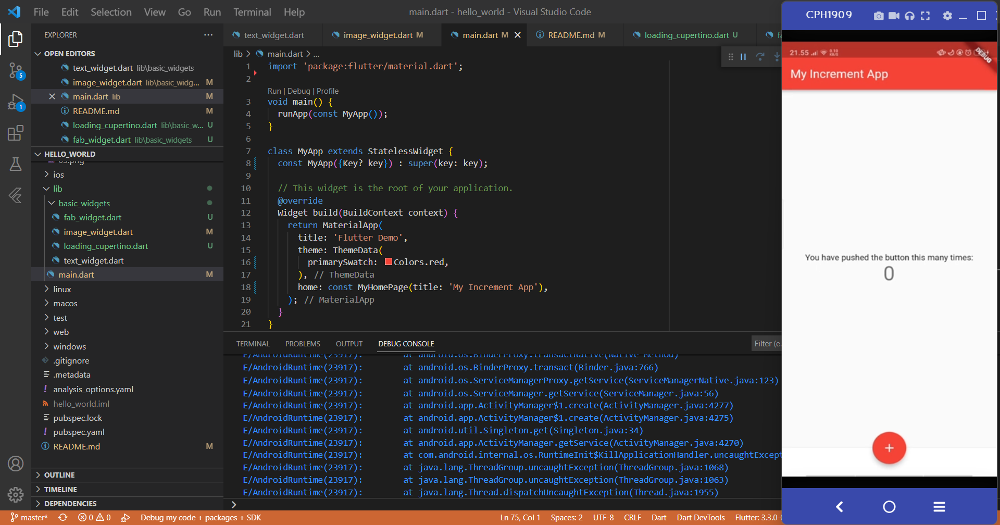
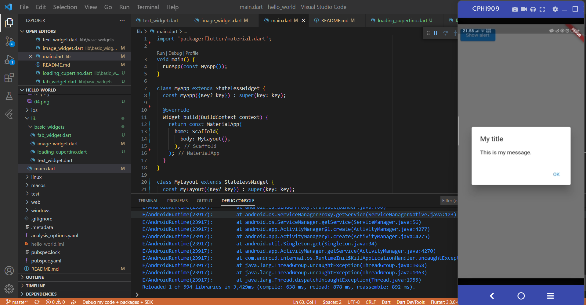
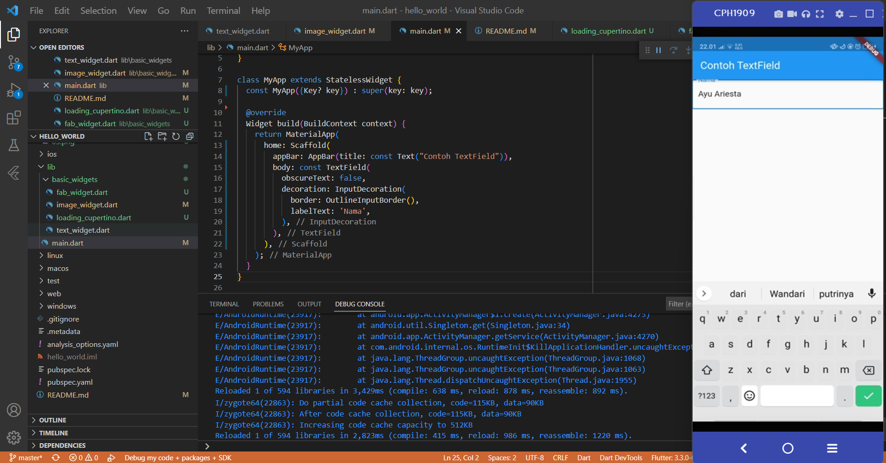
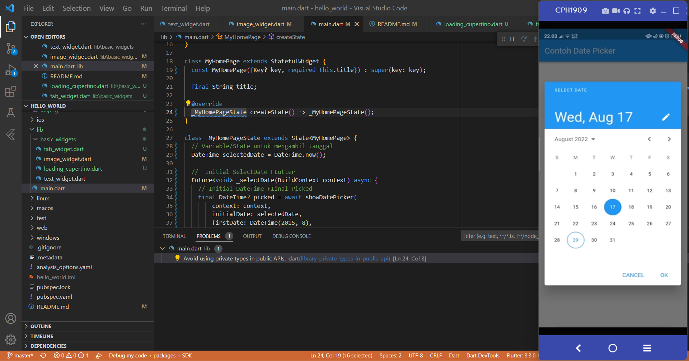

# hello_world

Praktikum hari 16 Flutter

## Praktikum 1: Membuat Project Flutter Baru

Pada praktikum ini, yaitu mencoba membuat sebuah project flutter baru menggunakan visual studio code

## Praktikum 2: Membuat Repository GitHub dan Laporan Praktikum

Di praktikum ini membuat repository github secara mengatur di vs code agar repo dan vs code bisa di hubungkan. Dan juga pedoman dalam menyusun laporan praktikum. Dibagian ini juga menjalankan project flutter.

## Praktikum 3: Menerapkan Widget Dasar
### Text Widget

Pada praktikum ini, kita mencoba mengubah tulisan yang ada pada tampilan di android.

### Image Widget

Pada praktikum ini, kita mengubah yang sebelumnya tulisan menjadi gambar dan mengaturnya di pubspec.yaml.

## Praktikum 4: Menerapkan Widget Material Design dan iOS Cupertino
### Scaffold Widget

Pada praktikum bagian ini, tampilan default project flutter akan diubah seperti pada gambar.

### Dialog Widget

Pada praktikum ini, akan ditampilkan alert. Dan apabila button di tekan, maka tanda alert akan muncul.

### Input dan Selection Widget

Pada praktikum ini, kita diajarkan untuk membuat sebuah input. Disini kita bisa memasukkan nama.

### Date and Time Pickers

Pada praktikum ini, kita diajarkan membuat date picker dan menerapkannya pada project flutter.