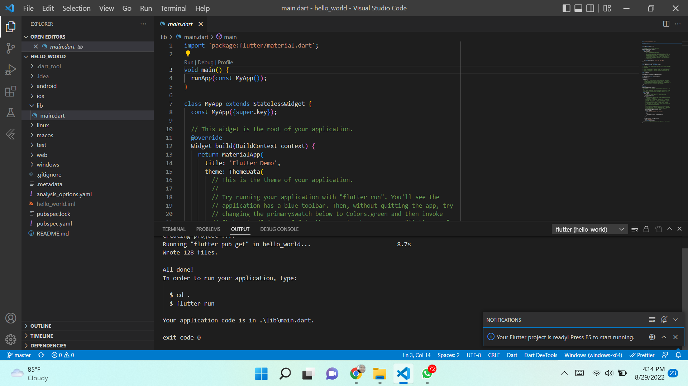
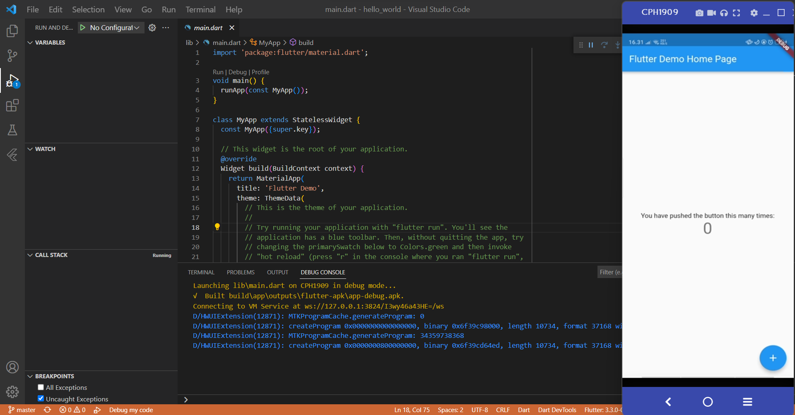
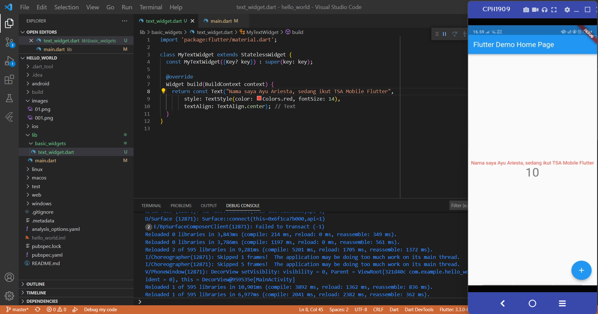
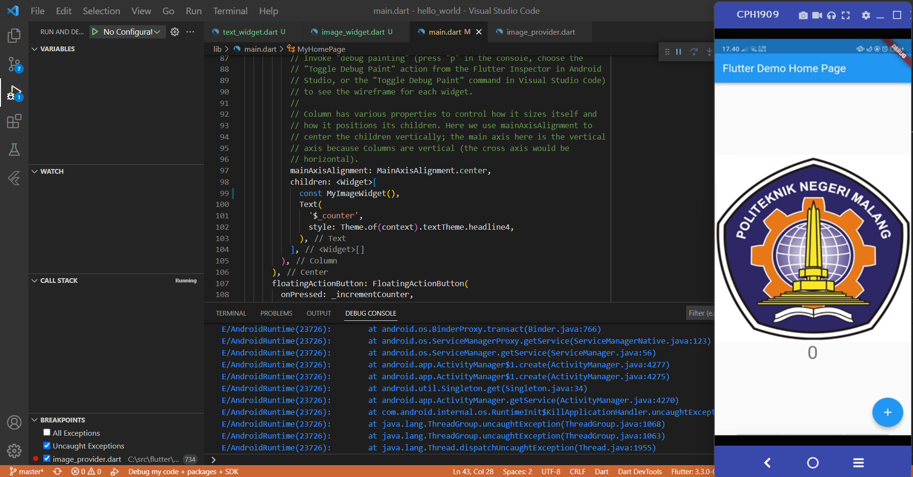

# hello_world

Praktikum hari 16 Flutter

## Praktikum 1: Membuat Project Flutter Baru

## Praktikum 2: Membuat Repository GitHub dan Laporan Praktikum

## Praktikum 3: Menerapkan Widget Dasar
Text Widget

Image Widget

